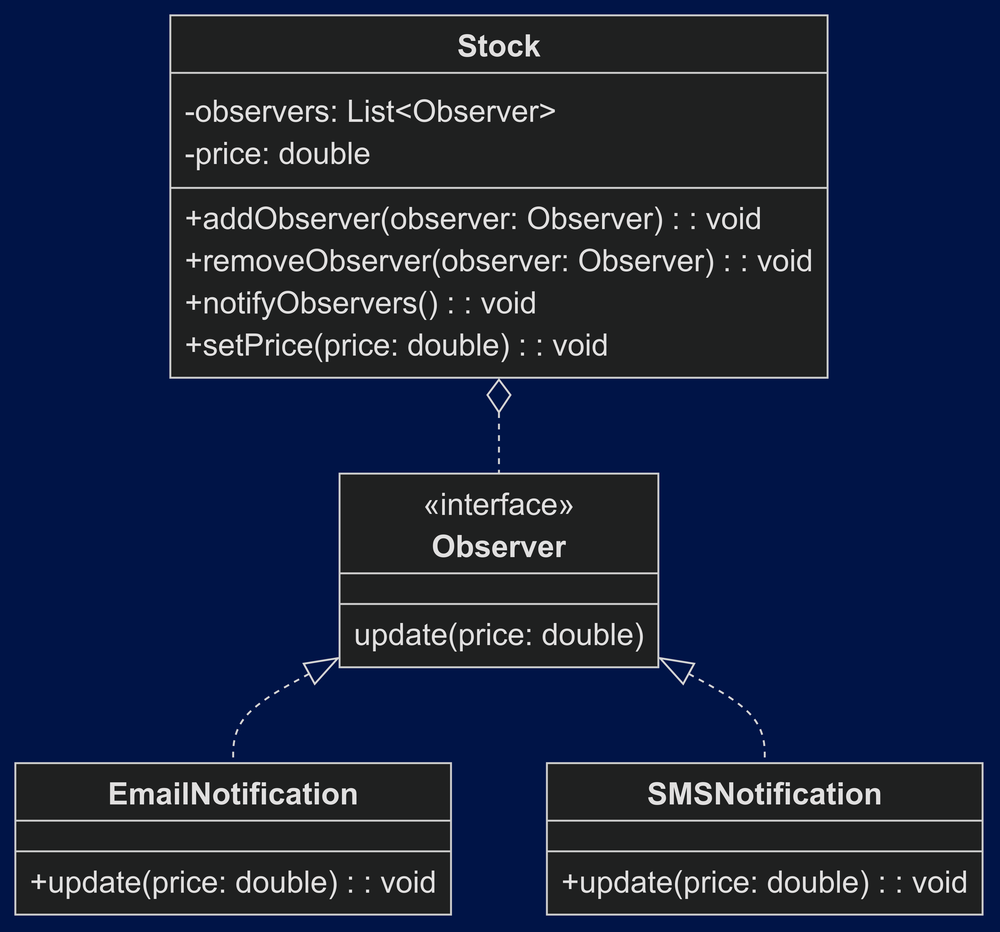

# Padrão Observer

## Intenção

> Definir uma dependência um-para-muitos entre objetos de modo que quando um objeto muda de estado, todos os seus dependentes são notificados e atualizados automaticamente.

## Exemplo

> Você tem um sistema de notificações que precisa notificar todos os usuários quando um produto tem seu preço alterado.

    a. EmailNotification: notifica usuários por e-mail;
    b. SMSNotification: notifica usuários por SMS;

> O padrão Observer é ideal para este cenário, pois permite que os objetos `EmailNotification` e `SMSNotification` sejam notificados automaticamente quando o objeto `Product` muda de estado.

## UML

