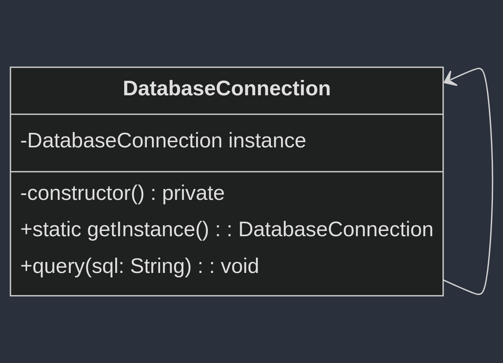

# Padrão Observer

## Intenção

> O padrão Singleton tem como objetivo garantir que uma classe tenha apenas uma única instância em toda a aplicação, fornecendo um ponto global de acesso a essa instância. Esse padrão é útil quando é importante controlar o acesso a recursos compartilhados, como a conexão com um banco de dados ou um gerenciador de configurações.

## Exemplo

> Imagine que você está desenvolvendo uma aplicação que precisa se conectar a um banco de dados. Ter múltiplas conexões ativas ao mesmo tempo pode desperdiçar recursos e causar problemas de sincronização. Para resolver isso, você quer garantir que apenas uma instância da classe que gerencia a conexão com o banco de dados seja criada e usada por toda a aplicação. O padrão Singleton é ideal para resolver esse problema.
>
> Podemos criar uma classe DatabaseConnection que segue o padrão Singleton. Ela terá um construtor privado para impedir a criação de novas instâncias e um método estático para fornecer a única instância dessa classe. Dessa forma, sempre que precisarmos da conexão com o banco de dados, utilizaremos a mesma instância.
	

## UML

