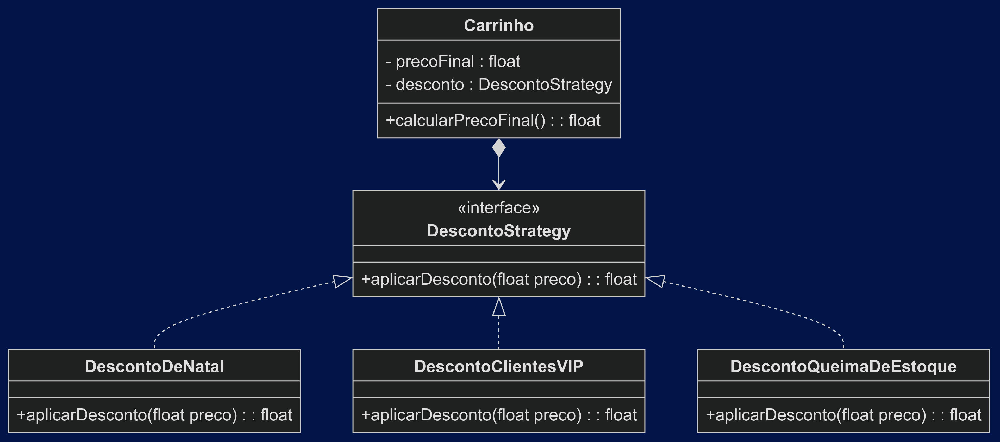

# Padrão Strategy

## Intenção

> Definir uma família de algoritmos, encapsular cada um deles e torná-los intercambiáveis. Strategy permite que o algoritmo varie independentemente dos clientes que o utilizam.

## Exemplo

> Você tem uma aplicação que precisa aplicar diferentes tipos de descontos dependendo do tipo de promoção vigente.

    a. Desconto VIP: 50% de desconto;
    b. Desconto de Natal: 20% de desconto;
    c. Queima de estoque: 90% de desconto.

> O padrão Strategy é ideal para resolver esse problema. Você pode criar uma interface `DiscountStrategy` que define um método `calculateDiscount` e implementar diferentes classes que implementam essa interface.

## UML

